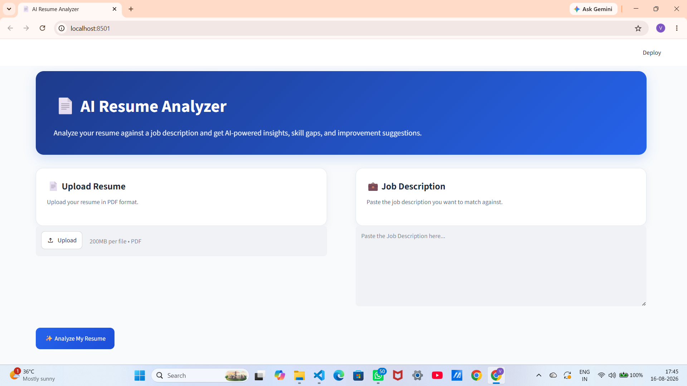

# 🤖 AI Resume Analyzer

An AI-powered resume analysis web application that compares a candidate's resume with a given job description and provides personalized insights, skill gaps, strengths, and practical improvement suggestions.

## ✨ Features

- 📄 Upload resumes in PDF format
- 🔍 Extract text from text-based PDFs
- 🖼️ OCR support for image-based/scanned PDFs
- 💼 Add a custom Job Description
- 🤖 AI-powered analysis using Google Gemini
- 📊 Resume–Job Description Match Score
- ✅ Identify matching skills
- ❌ Identify missing skills
- 💪 Highlight resume strengths
- 💡 Generate practical improvement suggestions
- 📝 Provide overall resume feedback

## 🧠 How It Works

1. Upload a resume in PDF format.
2. The application extracts text from the resume.
3. If the PDF contains scanned/image-based content, OCR is used to extract the text.
4. Paste the target Job Description.
5. The extracted resume content and Job Description are sent to Google Gemini.
6. Gemini analyzes the resume and generates personalized feedback.
7. The results include match score, skills, strengths, gaps, and improvement suggestions.

## 🛠️ Tech Stack

| Technology | Purpose |
|---|---|
| Python | Application logic |
| Streamlit | Web interface |
| Google Gemini API | AI-powered resume analysis |
| PyMuPDF | PDF text extraction |
| Tesseract OCR | OCR for image-based PDFs |
| pytesseract | Python interface for Tesseract |
| Pillow | Image processing |
| python-dotenv | Environment variable management |

## 📂 Project Structure

AI-Resume-Analyzer/
│
├── images/
│   ├── homepage.png
│   └── resume_analyser_demo.mp4
│
├── app.py
├── parser.py
├── prompts.py
├── utils.py
├── requirements.txt
├── README.md
└── .gitignore

## ⚙️ Installation & Setup

### 1. Clone the repository

git clone YOUR_GITHUB_REPOSITORY_URL
cd AI-Resume-Analyzer

### 2. Install dependencies

pip install -r requirements.txt

### 3. Configure the Gemini API

Create a `.env` file in the project directory:

GOOGLE_API_KEY=your_api_key_here

### 4. Run the application

streamlit run app.py

The application will open locally at:

http://localhost:8501

## 🔐 API Key Security

The Google Gemini API key is stored using an environment variable and is not hard-coded into the application.

The `.env` file should never be uploaded to GitHub.

Make sure `.env` is included in `.gitignore` before pushing the project.

## 📸 Screenshot

### Home Page

## 🎥 Demo

[▶️ Watch the Demo](images/resume_analyser_demo.mp4)

The demo shows the complete workflow:

Resume Upload → Job Description → AI Analysis → Personalized Resume Insights

## 🎯 Example Analysis

The analyzer evaluates a resume based on:

- Resume–Job Description compatibility
- Relevant technical and soft skills
- Missing or underrepresented skills
- Resume strengths
- Areas requiring improvement
- Overall suitability for the target role

## 🔮 Future Improvements

- ATS keyword analysis
- Visual resume scoring
- Support for additional document formats
- Job-specific keyword recommendations
- Resume section-wise scoring
- Enhanced analytics and visualizations
- Public cloud deployment

## 👩‍💻 Author

### Vanshika

B.Tech CSE | AI/ML Enthusiast

Built as a practical AI/ML project using Python, Streamlit, and Google Gemini.